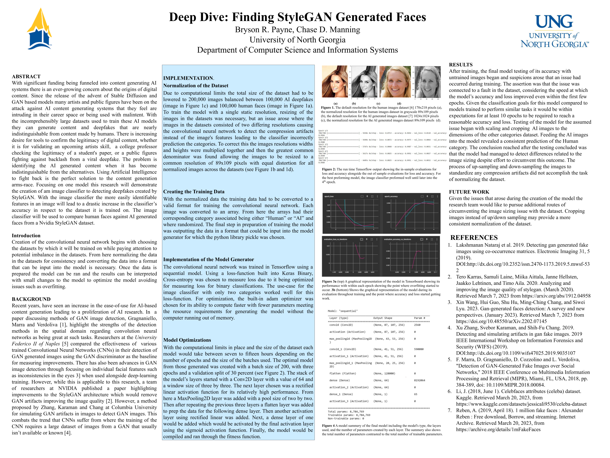

# 🔍 Deep Dive: Detecting AI-Generated Faces

The goal of this project was to engineer a Convolutional Neural Network (CNN) model for image classification between datasets consisting of authentic human portraits and AI-generated faces (StyleGAN). Leveraging Python's frameworks for machine learning such as TensorFlow and OpenCV I developed a Jupyter Notebook pipeline for image preprocessing, data normalization, feature extraction, and model validation, achieving high-precision classification.

<details>
  <summary>🖼️ <b>View Research Poster</b></summary>
  <br>
  
  [](documentation/ResearchPoster.pdf)
  <br>
  <sub><i>Click the image above to view the full PDF.</i></sub>
</details>
  
## 📂 Project Structure

```
/DeepDive-Detecting-AI-Generated-Faces
├── data/               # Image datasets (Human/AI)
├── documentation/      # Research poster & icon files
├── models/             # Trained .keras models
├── notebooks/          # Data processing & training scripts
├── .env.example        # Configuration template
├── .gitignore          # Version control exclusions
├── README.md           # Project documentation
├── Tensorboard.bat     # Opens Tensorboard interface
├── Tensorflow.bat      # Opens Tensorflow interface
├── requirements.txt    # Python library dependencies
└── setup.bat           # Automated environment setup
```

## 🚀 Getting Started

1. Clone the repository using: `git clone https://github.com/cdmanning/DeepDive-Detecting-AI-Generated-Faces.git`

2. Ensure you have [Python 3.12](https://www.python.org/downloads/) installed and correctly added to your system PATH.

3. Run `setup.bat` to automatically install all required Python libraries and generate the necessary project folders.

4. Rename the `.env.example` file to `.env` and verify the `DATADIR` path points to your target dataset location.

5. Download the image sets and place them into the `./data/Human` and `./data/AI` directories:
    - Human Dataset: [CelebA Dataset](https://www.kaggle.com/datasets/jessicali9530/celeba-dataset)
    - AI-Generated Dataset: [1M Fake Faces Dataset](https://archive.org/details/1mFakeFaces)

6. Run `start.bat` to initialize the Jupyter Notebook environment and begin training the model.

## ⚖️ Licensing
- All source code in this repository is **All Rights Reserved**.
- The research poster and findings are licensed under **[CC BY-NC 4.0 Attribution-NonCommercial](https://creativecommons.org/licenses/by-nc/4.0/)**.

##
*Developed as part of the 2023 UNG Annual Research Conference.*
